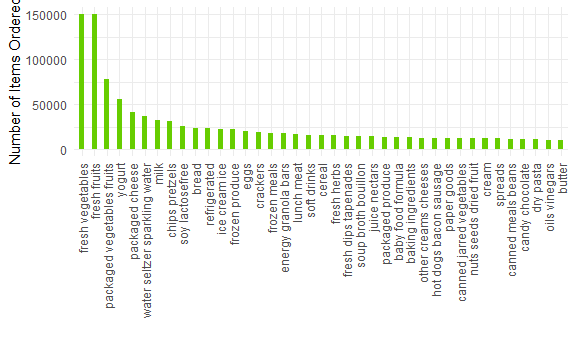

P8105_HW3_HL2710
================
Ainsel Levitskaia-Collins, HL2710
2025-10-08

### Preliminary Setup

Adjusting settings such that figures and graphs will be readable:

``` r
library(tidyverse)

knitr::opts_chunk$set(
  fig.width = 6,
  fig.asp = .6,
  out.width = "90%"
)

theme_set(theme_minimal() + theme(legend.position = "bottom"))

options(
  ggplot2.continuous.colour = "viridis",
  ggplot2.continuous.fill = "viridis"
)

scale_colour_discrete = scale_colour_viridis_d
scale_fill_discrete = scale_fill_viridis_d
```

### Problem 1

Loading the dataset that will be used in this problem:

``` r
library(p8105.datasets)
data("instacart")
```

The `instacart` dataset has 1384617 observations of 15 variables. The
variables include information such as which user made the order
(`user_id`), which items are in the cart (`product_id`), whether these
items are being reordered (`reordered`), the name of the product
(`product_name`), and other such information. For example, the first
item added to user 112108’s cart was Bulgarian Yogurt with a product ID
of 49302, and this is a reordered item.

#### Determining Aisle Information

First, producing a dataset with number of items ordered per aisle:

``` r
instacart_aislecounts <- instacart %>% 
  count(aisle, name = "num_items_ordered") %>% 
  arrange(desc(num_items_ordered))
```

Then, selecting the top 5 most popular aisles:

``` r
instacart_aislecounts %>% slice_head(n = 5)
```

    ## # A tibble: 5 × 2
    ##   aisle                      num_items_ordered
    ##   <chr>                                  <int>
    ## 1 fresh vegetables                      150609
    ## 2 fresh fruits                          150473
    ## 3 packaged vegetables fruits             78493
    ## 4 yogurt                                 55240
    ## 5 packaged cheese                        41699

There are 134 aisles within the `instacart` dataset, and the top 5
aisles that the most items are ordered from are fresh vegetables, fresh
fruits, packaged vegetables and fruits, yogurt, and packaged cheese.

#### Number of Ordered Items per Aisle

Creating a plot that shows the number of items ordered per aisle,
limited to only aisles with more than 10,000 items ordered:

``` r
instacart_aislecounts %>% 
  filter(num_items_ordered > 10000) %>% 
  mutate(aisle = fct_reorder(aisle, desc(num_items_ordered))) %>% 
  ggplot(aes(x = aisle, y = num_items_ordered)) +
  geom_bar(stat = "identity", fill = "chartreuse3", width = .4) +
  theme(axis.text.x = element_text(angle = 90, vjust = 0.5, hjust = 1)) +
  xlab("") +
  ylab("Number of Items Ordered")
```



#### Table of Most Popular Items

Creating a table of the three most popular items in the aisles “baking
ingredients”, “dog food care”, and “packaged vegetables fruits”.

1.  Keeping only the desired aisles
2.  Counting by `product_name` after grouping by `aisle` and
    `product_name` so that every product has an associated number of
    times it was ordered
3.  Keeping only the three most popular items per aisle
4.  Converting from long to wide format for readability

First, creating a database with information on aisle name, product name,
and how many times each item has been ordered:

``` r
instacart_popular <- instacart %>% 
  filter(aisle == c("baking ingredients", "dog food care", "packaged vegetables fruits")) %>% 
  group_by(aisle) %>% 
  count(product_name, name = "num_items_ordered") %>% 
  arrange(desc(num_items_ordered)) %>% 
  filter(min_rank(desc(num_items_ordered)) < 4)
```

Creating a table to display this information:

``` r
knitr::kable(
  instacart_popular,
  col.names = c("Aisle", "Product Name", "Number of Items Ordered")
)
```

| Aisle | Product Name | Number of Items Ordered |
|:---|:---|---:|
| packaged vegetables fruits | Organic Baby Spinach | 3324 |
| packaged vegetables fruits | Organic Raspberries | 1920 |
| packaged vegetables fruits | Organic Blueberries | 1692 |
| baking ingredients | Light Brown Sugar | 157 |
| baking ingredients | Pure Baking Soda | 140 |
| baking ingredients | Organic Vanilla Extract | 122 |
| dog food care | Organix Grain Free Chicken & Vegetable Dog Food | 14 |
| dog food care | Organix Chicken & Brown Rice Recipe | 13 |
| dog food care | Original Dry Dog | 9 |

### Table of Mean hr Day per Week when Pink Lady Apples and Coffee Ice Cream are Ordered

Creating a table in which, for every day of the week, the mean hour of
the day at which Pink Lady Apples and Coffee Ice Cream are ordered is
displayed.

1.  Keeping only the desired products
2.  Grouping by day of week
3.  Creating a mean time of order variable
4.  Using `pivot_wider` to make the data human-readable

I would like to note that while under normal circumstances, I would have
renamed the `order_dow` contents from 0-6 to corresponding days of the
week, I could not find any confirmation online for whether 0
corresponded to Monday, Sunday, or something else, and have as such
chosen to leave `order_dow` in its numerical format.

``` r
instacart_times <- instacart %>% 
  filter(product_name == c("Pink Lady Apples", "Coffee Ice Cream")) %>% 
  group_by(product_name, order_dow) %>% 
  summarize(mean_time = mean(order_hour_of_day, na.rm = TRUE)) %>% 
  pivot_wider(
    names_from = "product_name",
    values_from = "mean_time"
  )
```

Creating a table to display this information:

``` r
knitr::kable(
  instacart_times,
  col.names = c("Day of Week", "Coffee Ice Cream (military time)", "Pink Lady Apples (military time)"),
  digits = 0
)
```

| Day of Week | Coffee Ice Cream (military time) | Pink Lady Apples (military time) |
|---:|---:|---:|
| 0 | 13 | 12 |
| 1 | 15 | 12 |
| 2 | 15 | 12 |
| 3 | 15 | 14 |
| 4 | 15 | 12 |
| 5 | 10 | 14 |
| 6 | 12 | 12 |

### Problem 2

Importing and cleaning the Zillow dataset, based on what was done in
Homework 2:

Importing and cleaning the `zori` dataset:

1.  Importing and cleaning
2.  Renaming `region_name` to `zip_code` to match the `zipcodes`
    dataset, and moving that variable to the front
3.  Converting the dates and rental prices from wide to long format
4.  Adjusting `county_name` to match the corresponding variable in the
    `zipcodes` dataset
5.  Renaming the `county` variable so that both the name and contents
    reflect the NYC boroughs
6.  Cleaning the dates so that year, month, and day are separate
    variables and appropriately named

``` r
zori <-
  read_csv("./data/Zip_zori_uc_sfrcondomfr_sm_month_NYC.csv") %>% 
  janitor::clean_names() %>% 
  select(zip_code = region_name, everything()) %>% 
  separate(county_name, into = c("county", "extra"), sep = " C") %>% 
  select(-extra, -state_name)

zori_neat <-
  pivot_longer(
    zori,
    x2015_01_31:x2024_08_31,
    names_to = "date",
    names_prefix = "x",
    values_to = "rental_price") %>% 
  mutate(
    county = case_match(county,
      "Kings" ~ "Brooklyn",
      "New York" ~ "Manhattan",
      "Richmond" ~ "Staten Island",
      "Bronx" ~ "Bronx",
      "Queens" ~ "Queens")
  ) %>% 
  rename(borough = county) %>% 
  separate_wider_delim(date, names = c("year", "month", "day"), delim = "_") %>% 
  mutate(
    month = case_match(month,
      "01" ~ "January",
      "02" ~ "February",
      "03" ~ "March",
      "04" ~ "April",
      "05" ~ "May",
      "06" ~ "June",
      "07" ~ "July",
      "08" ~ "August",
      "09" ~ "September",
      "10" ~ "October",
      "11" ~ "November",
      "12" ~ "December"))
```

#### Zip Code Counts

``` r
zip_counts <- zori_neat %>%
  drop_na(rental_price) %>% 
  count(zip_code, name = "times_observed")
```

There are 48 zip codes observed 116 times within the Zillow `zori`
dataset, and there are 26 zip codes observed less than 10 times within
the Zillow `zori` dataset. Zillow is a website that both manages renting
and selling of properties, and it is not the only website used within
NYC to manage renting properties (StreetEasy being an alternative
option). As such, the zip codes which appear more often within the
Zillow dataset, such as 10001 or 10003, are in popular locations to live
within NYC, whereas zip codes that appear less often, such as 10453, are
in less popular locations to live within NYC, which likely reflects the
demographic that tend to use Zillow, both from a landlord and renter
perspective.

#### Average Rental Price per Borough and Year

Creating a database with the average rental price per year for each
borough:

``` r
avg_price_year <- zori_neat %>% 
  group_by(borough, year) %>% 
  summarize(mean_price = mean(rental_price, na.rm = TRUE)) %>% 
  pivot_wider(
    names_from = "borough",
    values_from = "mean_price"
  )
```

Creating a table out of the database:

``` r
options(knitr.kable.NA = "---")
knitr::kable(
  avg_price_year,
  digits = 1
)
```

| year |  Bronx | Brooklyn | Manhattan | Queens | Staten Island |
|:-----|-------:|---------:|----------:|-------:|--------------:|
| 2015 | 1759.6 |   2492.9 |    3022.0 | 2214.7 |             — |
| 2016 | 1520.2 |   2520.4 |    3038.8 | 2272.0 |             — |
| 2017 | 1543.6 |   2545.8 |    3133.8 | 2263.3 |             — |
| 2018 | 1639.4 |   2547.3 |    3183.7 | 2291.9 |             — |
| 2019 | 1705.6 |   2630.5 |    3310.4 | 2387.8 |             — |
| 2020 | 1811.4 |   2555.1 |    3106.5 | 2315.6 |        1977.6 |
| 2021 | 1857.8 |   2549.9 |    3136.6 | 2210.8 |        2045.4 |
| 2022 | 2054.3 |   2868.2 |    3778.4 | 2406.0 |        2147.4 |
| 2023 | 2285.5 |   3015.2 |    3932.6 | 2561.6 |        2332.9 |
| 2024 | 2496.9 |   3126.8 |    4078.4 | 2694.0 |        2536.4 |

Within this table, we can see that all boroughs have had an increase in
rental price over the past 9 years. Queens has had the smallest overall
rent increase, despite Staten Island not having data until 2020, and
Manhattan has had the largest overall rent increase.
